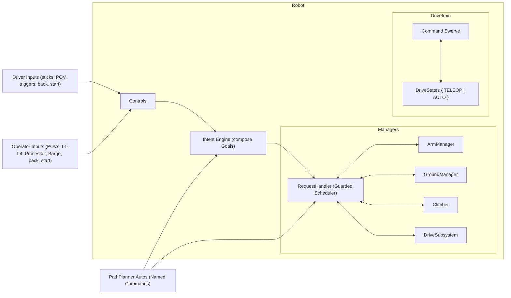
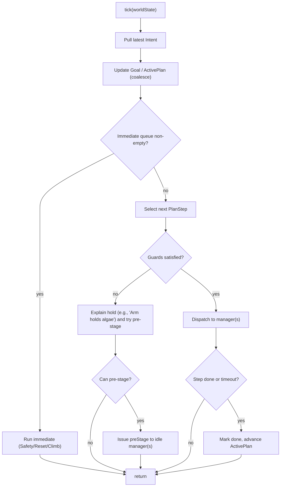
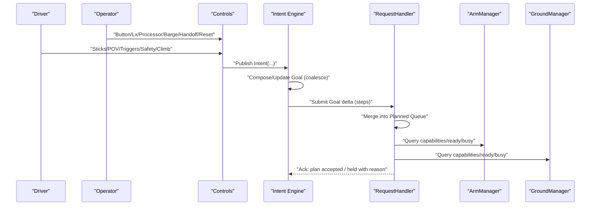
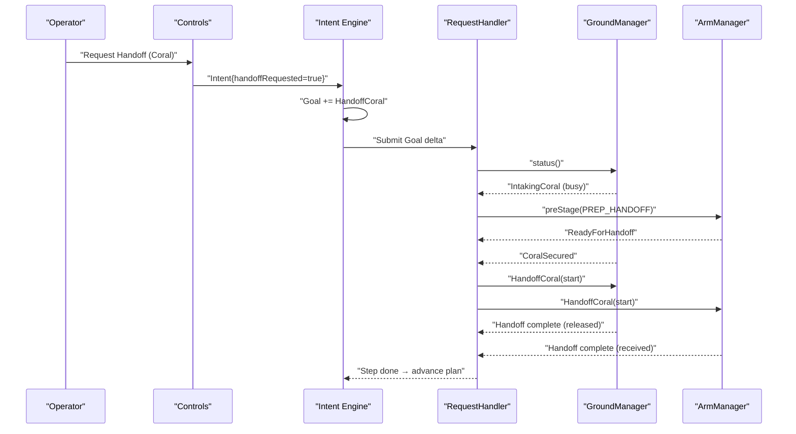
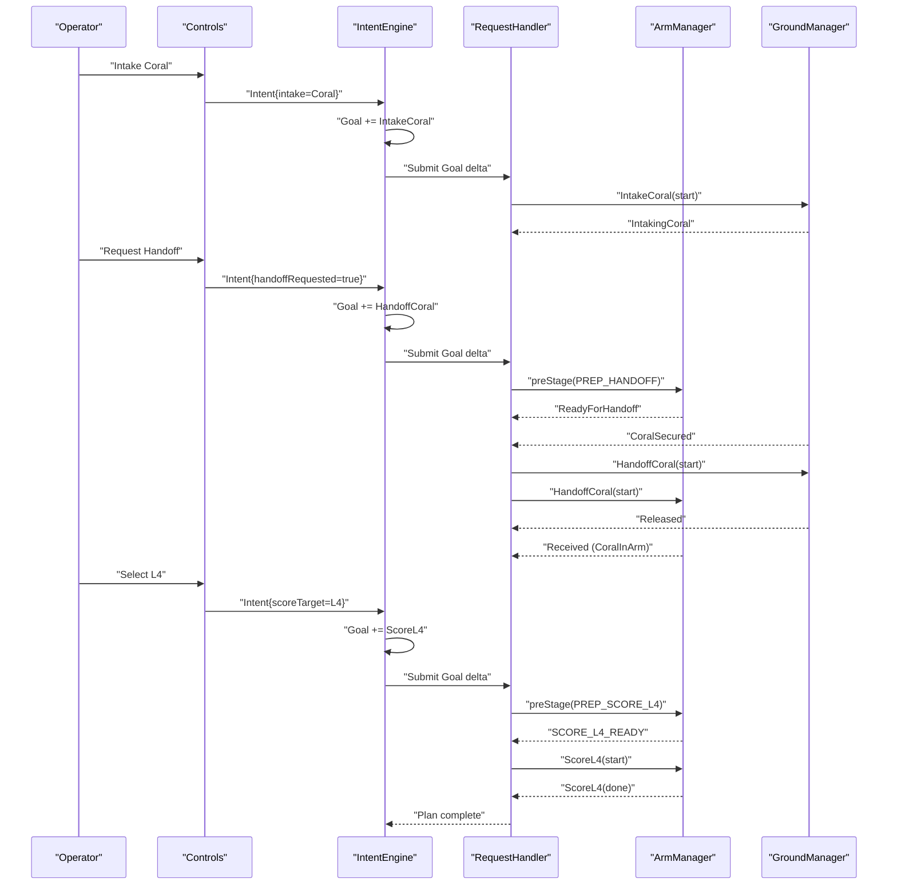
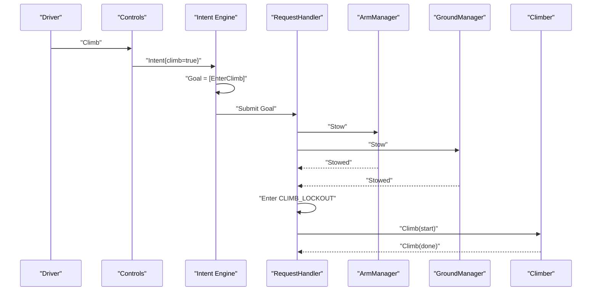

# O2025 Control Diagrams

## Top-Level Architecture

```mermaid
flowchart LR
  Driver["Driver Inputs (sticks, POV, triggers, back, start)"] --> Controls
  Operator["Operator Inputs (POVs, L1-L4, Processor, Barge, back, start)"] --> Controls

  subgraph Robot
    Controls --> IntentEngine["Intent Engine (compose Goals)"]
    IntentEngine --> RequestHandler["RequestHandler (Guarded Scheduler)"]

    subgraph Managers
      RequestHandler <---> ArmManager
      RequestHandler <---> GroundManager
      RequestHandler <---> Climber
      RequestHandler <---> DriveSubsystem
    end

    subgraph Drivetrain
      CommandSwerve["Command Swerve"]
      DriveStates["DriveStates { TELEOP | AUTO }"]
      CommandSwerve <---> DriveStates
    end
  end

  PathPlanner["PathPlanner Autos (Named Commands)"] --> IntentEngine
  PathPlanner --> RequestHandler
```

## O2025 Scheduler Tick

```mermaid
flowchart TD
  A["tick(worldState)"] --> B["Pull latest Intent"]
  B --> C["Update Goal / ActivePlan (coalesce)"]
  C --> D{"Immediate queue non-empty?"}
  D -- "yes" --> E["Run immediate (Safety/Reset/Climb)"]
  E --> Aend["return"]
  D -- "no" --> F["Select next PlanStep"]
  F --> G{"Guards satisfied?"}
  G -- "no" --> H["Explain hold (e.g., 'Arm holds algae') and try pre-stage"]
  H --> I{"Can pre-stage?"}
  I -- "yes" --> J["Issue preStage to idle manager(s)"]
  I -- "no" --> Aend
  J --> Aend
  G -- "yes" --> K["Dispatch to manager(s)"]
  K --> L{"Step done or timeout?"}
  L -- "no" --> Aend
  L -- "yes" --> M["Mark done, advance ActivePlan"]
  M --> Aend
```

## Sequence Overview

```mermaid
sequenceDiagram
  participant Dr as "Driver"
  participant Op as "Operator"
  participant Controls as "Controls"
  participant IE as "Intent Engine"
  participant RH as "RequestHandler"
  participant AM as "ArmManager"
  participant GM as "GroundManager"

  Op->>Controls: "Button/Lx/Processor/Barge/Handoff/Reset"
  Dr->>Controls: "Sticks/POV/Triggers/Safety/Climb"
  Controls->>IE: "Publish Intent{...}"
  IE->>IE: "Compose/Update Goal (coalesce)"
  IE->>RH: "Submit Goal delta (steps)"

  RH->>RH: "Merge into Planned Queue"
  RH->>AM: "Query capabilities/ready/busy"
  RH->>GM: "Query capabilities/ready/busy"
  RH-->>IE: "Ack: plan accepted / held with reason"
```

## Handoff while Intaking

```mermaid
sequenceDiagram
  participant Op as "Operator"
  participant Controls as "Controls"
  participant IE as "Intent Engine"
  participant RH as "RequestHandler"
  participant GM as "GroundManager"
  participant AM as "ArmManager"

  Op->>Controls: "Request Handoff (Coral)"
  Controls->>IE: "Intent{handoffRequested=true}"
  IE->>IE: "Goal += HandoffCoral"
  IE->>RH: "Submit Goal delta"

  RH->>GM: "status()"
  GM-->>RH: "IntakingCoral (busy)"
  RH->>AM: "preStage(PREP_HANDOFF)"
  AM-->>RH: "ReadyForHandoff"

  GM-->>RH: "CoralSecured"
  RH->>GM: "HandoffCoral(start)"
  RH->>AM: "HandoffCoral(start)"
  GM-->>RH: "Handoff complete (released)"
  AM-->>RH: "Handoff complete (received)"
  RH-->>IE: "Step done → advance plan"
```

## Intake → Handoff → L4

```mermaid
sequenceDiagram
  participant Op as "Operator"
  participant Controls as "Controls"
  participant IE as "IntentEngine"
  participant RH as "RequestHandler"
  participant AM as "ArmManager"
  participant GM as "GroundManager"

  %% 1) Start intake (Coral)
  Op->>Controls: "Intake Coral"
  Controls->>IE: "Intent{intake=Coral}"
  IE->>IE: "Goal += IntakeCoral"
  IE->>RH: "Submit Goal delta"
  RH->>GM: "IntakeCoral(start)"
  GM-->>RH: "IntakingCoral"

  %% 2) While intake runs, operator requests Handoff
  Op->>Controls: "Request Handoff"
  Controls->>IE: "Intent{handoffRequested=true}"
  IE->>IE: "Goal += HandoffCoral"
  IE->>RH: "Submit Goal delta"

  RH->>AM: "preStage(PREP_HANDOFF)"
  AM-->>RH: "ReadyForHandoff"
  GM-->>RH: "CoralSecured"
  RH->>GM: "HandoffCoral(start)"
  RH->>AM: "HandoffCoral(start)"
  GM-->>RH: "Released"
  AM-->>RH: "Received (CoralInArm)"

  %% 3) Operator selects L4, arm pre-stages while driver aligns
  Op->>Controls: "Select L4"
  Controls->>IE: "Intent{scoreTarget=L4}"
  IE->>IE: "Goal += ScoreL4"
  IE->>RH: "Submit Goal delta"

  RH->>AM: "preStage(PREP_SCORE_L4)"
  AM-->>RH: "SCORE_L4_READY"
  RH->>AM: "ScoreL4(start)"
  AM-->>RH: "ScoreL4(done)"
  RH-->>IE: "Plan complete"
```

## Climb Lockout

```mermaid
sequenceDiagram
  participant Dr as "Driver"
  participant Controls as "Controls"
  participant IE as "Intent Engine"
  participant RH as "RequestHandler"
  participant AM as "ArmManager"
  participant GM as "GroundManager"
  participant CM as "Climber"

  Dr->>Controls: "Climb"
  Controls->>IE: "Intent{climb=true}"
  IE->>IE: "Goal = [EnterClimb]"
  IE->>RH: "Submit Goal"

  RH->>AM: "Stow"
  RH->>GM: "Stow"
  AM-->>RH: "Stowed"
  GM-->>RH: "Stowed"
  RH->>RH: "Enter CLIMB_LOCKOUT"
  RH->>CM: "Climb(start)"
  CM-->>RH: "Climb(done)"
```
