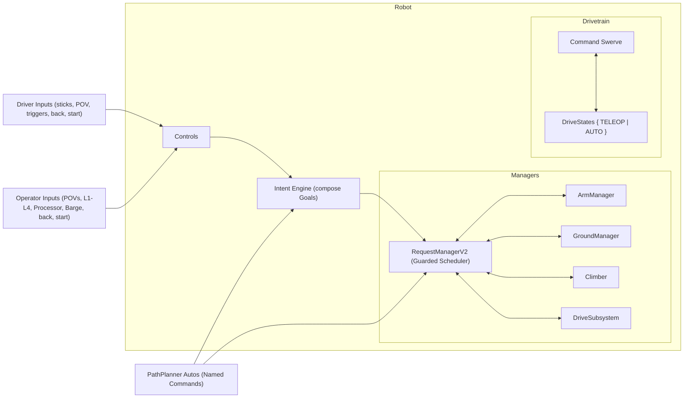

# O2025 Scheduler Tick

```mermaid
flowchart LR
  Driver["Driver Inputs (sticks, POV, triggers, back, start)"] --> Controls
  Operator["Operator Inputs (POVs, L1-L4, Processor, Barge, back, start)"] --> Controls

  subgraph Robot
    Controls --> IntentEngine["Intent Engine (compose Goals)"]
    IntentEngine --> Scheduler["RequestManagerV2 (Guarded Scheduler)"]

    subgraph Managers
      Scheduler <---> ArmManager
      Scheduler <---> GroundManager
      Scheduler <---> Climber
      Scheduler <---> DriveSubsystem
    end

    subgraph Drivetrain
      CommandSwerve["Command Swerve"]
      DriveStates["DriveStates { TELEOP | AUTO }"]
      CommandSwerve <---> DriveStates
    end
  end

  PathPlanner["PathPlanner Autos (Named Commands)"] --> IntentEngine
  PathPlanner --> Scheduler
```
